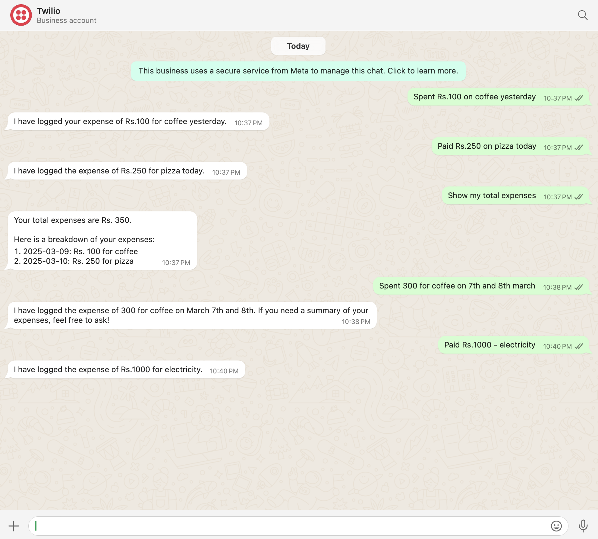

# 📌 WhatsApp Expense Tracker



A simple **WhatsApp-based Expense Tracker** 📊💰 powered by **OpenAI**, **Google Sheets**, and **Twilio**.  
Log your expenses directly from WhatsApp and get expense summaries instantly! 🚀  

## 🛠 Features  
✅ Log expenses via WhatsApp  
✅ AI-powered expense extraction (Amount, Category, Date)  
✅ Google Sheets integration for storage  
✅ Get daily/monthly expense summaries  
✅ Deployed on **Render**  

---

## 🔥 1. Clone & Setup the Project  
### 📥 Clone the Repository  
```sh
git clone https://github.com/Harika-BV/Whatsapp-Expense-Tracker.git
cd Whatsapp-Expense-Tracker
```

## 🐍 2. Create & Activate Virtual Environment
```sh
python -m venv venv        # Create virtual environment
source venv/bin/activate   # Activate (Mac/Linux)
venv\Scripts\activate      # Activate (Windows)
```

## 📦 3. Install Dependencies
```sh
pip install -r requirements.txt
```

## 🔑 4. Set Up Environment Variables
```sh
OPENAI_API_KEY="your-openai-key"
GOOGLE_SHEETS_CREDENTIALS="your-google-credentials.json"
```

## 📜 5. Google Sheets Setup
<p>1️⃣ Create a Google Service Account</p>
<p>2️⃣ Download the credentials JSON file</p>
<p>3️⃣ Share your Google Sheet with the service account email</p>

Ensure your Google Sheet has these columns:
| Date       | Amount | Category | Description   |
|------------|--------|----------|--------------|
| 2025-03-08 | ₹250   | Food     | Pizza dinner |

## 🛠 6. Test Locally with Ngrok
### Start the Flask Server
```sh
python src/app.py
```

### Expose Local Server via Ngrok
```sh
ngrok http 500
```

## 📞 7. Connect Twilio Webhook

### Copy the Ngrok HTTPS URL and set it as your Twilio Webhook

<p>1️⃣ Go to Twilio Console</p>
<p>2️⃣ Navigate to WhatsApp Sandbox</p>
<p>3️⃣ Set the Webhook URL to:</p>

```
https://your-ngrok-url/webhook
```

## 🎯 8. How to Use
Once the bot is live, you can interact with it via WhatsApp. Just send a message to your Twilio number, and the bot will process your request using AI.

### 📌 Basic Commands
- ✅ Logging an Expense
- 📩 Send a message like this:

```sh
Spent ₹250 on pizza today
```

### 💾 What happens?
- The bot extracts the amount, category, and date.
- It logs the expense in Google Sheets automatically.

## 📲 How to Text on WhatsApp to Your Twilio Number
- Get your Twilio number from your Twilio console.
- Save the number on your phone 📱.
- Open WhatsApp and send any of the above messages to test your bot.
- Get instant responses 🚀!